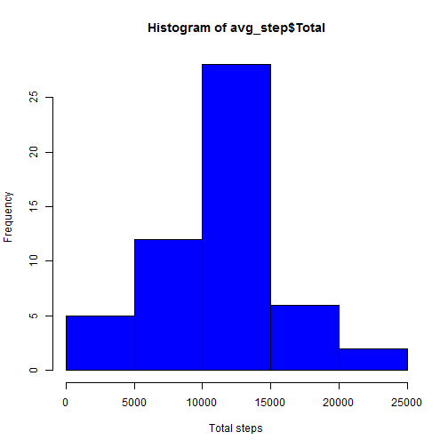
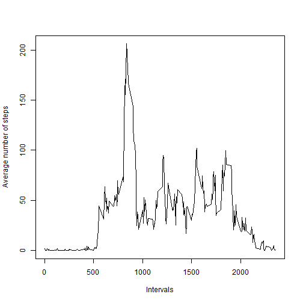
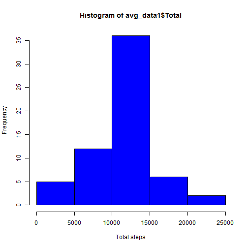
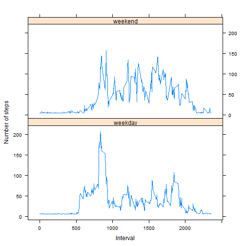

# Reproducible Research: Peer Assessment 1
This analysis was conducted on data collected from personal activity device.We want to explore the pattern of activity at 5 minute intervals,and whether the activity pattern in weekdays differs from the weekend


## load the required library

```r
library(lattice)
```


## Loading and preprocessing the data
The data was read in from a file in the working directory.The dates were transformed into dates data type, and the average steps of each 5 minute interval was calculated.The result is displayed in the histogram.


```r
#read in the data
activity_data <- read.csv("activity.csv")
```


```r
#transform the date with 
activity_data$date <- as.Date(activity_data$date)
```


```r
avg_step <- aggregate(activity_data$steps,by= list(activity_data$date), FUN= sum) 
names(avg_step) <- c("Date","Total")
```


```r
hist(avg_step$Total, xlab = "Total steps", col="blue")
```

 

```r
summary(avg_step)
```

```
##       Date                Total      
##  Min.   :2012-10-01   Min.   :   41  
##  1st Qu.:2012-10-16   1st Qu.: 8841  
##  Median :2012-10-31   Median :10765  
##  Mean   :2012-10-31   Mean   :10766  
##  3rd Qu.:2012-11-15   3rd Qu.:13294  
##  Max.   :2012-11-30   Max.   :21194  
##                       NA's   :8
```

## What is mean total number of steps taken per day?
the total number of steps taken per day has a mean of 10766 steps and a median of 10765 steps per day as seen in the summary of avg_step.


## What is the average daily activity pattern?
The average steps taken in each 5 minute interval was calculated

```r
avg_daily <- aggregate(activity_data$steps,by= list(activity_data$interval), FUN = mean,na.rm = TRUE)
col_names <- c("interval_step","avg_step")
names(avg_daily) <- col_names
```
The calculated average steps of the 5 minute intervals was plotted.


```r
plot(avg_daily$interval_step,avg_daily$avg_step,type='l',xlab="Intervals",ylab="Average number of steps")
```

 

```r
summary(avg_daily)
```

```
##  interval_step     avg_step     
##  Min.   :   0   Min.   :  0.00  
##  1st Qu.: 589   1st Qu.:  2.49  
##  Median :1178   Median : 34.11  
##  Mean   :1178   Mean   : 37.38  
##  3rd Qu.:1766   3rd Qu.: 52.83  
##  Max.   :2355   Max.   :206.17
```

As can be seen from the plot of average number of steps vs the 5-minute intervals,the highest number of steps on average are taken on the 835th interval.


## Imputing missing values
To calculate the total number of missing values in the data set we subset the dataset with any missing values

```r
missValue <- activity_data[!complete.cases(activity_data),]
```
the total number of missing values is given by 

```r
nrow(missValue)
```

```
## [1] 2304
```
thus we have 2304 records with missing values.Also a summary of the dataset reveals the number of
missing values.

```r
summary(activity_data)
```

```
##      steps            date               interval   
##  Min.   :  0.0   Min.   :2012-10-01   Min.   :   0  
##  1st Qu.:  0.0   1st Qu.:2012-10-16   1st Qu.: 589  
##  Median :  0.0   Median :2012-10-31   Median :1178  
##  Mean   : 37.4   Mean   :2012-10-31   Mean   :1178  
##  3rd Qu.: 12.0   3rd Qu.:2012-11-15   3rd Qu.:1766  
##  Max.   :806.0   Max.   :2012-11-30   Max.   :2355  
##  NA's   :2304
```
To replace the missing values with their mean,we calculate the mean of the steps and the interval as follows:

```r
mean_steps <- mean(activity_data$steps,na.rm = TRUE)
mean_interval <- mean(as.numeric(as.character(activity_data$interval)), na.rm = TRUE)
```
We then replace the missing values in steps and interval variables with their mean.


```r
activity_data1 <- activity_data
activity_data1$steps[is.na(activity_data1$steps)] <- mean_steps
activity_data1$interval[is.na(activity_data1$interval)] <- mean_interval
```


```r
summary(activity_data1)
```

```
##      steps            date               interval   
##  Min.   :  0.0   Min.   :2012-10-01   Min.   :   0  
##  1st Qu.:  0.0   1st Qu.:2012-10-16   1st Qu.: 589  
##  Median :  0.0   Median :2012-10-31   Median :1178  
##  Mean   : 37.4   Mean   :2012-10-31   Mean   :1178  
##  3rd Qu.: 37.4   3rd Qu.:2012-11-15   3rd Qu.:1766  
##  Max.   :806.0   Max.   :2012-11-30   Max.   :2355
```

As the summary shows we have replaced the missing values with their column mean.
In a similar manner to our previous calculation of total number of steps taken:

```r
avg_data1 <- aggregate(activity_data1$steps,by = list(activity_data1$date), FUN = sum)
names(avg_data1) <- c("Date","Total")
hist(avg_data1$Total,xlab = "Total steps",col = "blue")
```

 

```r
summary(avg_data1)
```

```
##       Date                Total      
##  Min.   :2012-10-01   Min.   :   41  
##  1st Qu.:2012-10-16   1st Qu.: 9819  
##  Median :2012-10-31   Median :10766  
##  Mean   :2012-10-31   Mean   :10766  
##  3rd Qu.:2012-11-15   3rd Qu.:12811  
##  Max.   :2012-11-30   Max.   :21194
```
As the summary shows the mean and the median are the same 10770 which is slightly higher than the mean of the dataset with missing values(10766) and the median(10765).
Imputing the missing values raises the mean and the median.


## Are there differences in activity patterns between weekdays and weekends?


```r
day_week <- weekdays(activity_data1$date)
activity_data1 <- cbind(activity_data1,day_week)
```


```r
#convert the day_week into factor with 2 levels
#change the name of the day into weekday and weekend
activity_data1$day_week <- gsub("Saturday","weekend",activity_data1$day_week)
activity_data1$day_week <- gsub("Sunday","weekend",activity_data1$day_week)
activity_data1$day_week <- gsub("Monday","weekday",activity_data1$day_week)
activity_data1$day_week <- gsub("Tuesday","weekday",activity_data1$day_week)
activity_data1$day_week <- gsub("Wednesday","weekday",activity_data1$day_week)
activity_data1$day_week <- gsub("Thursday","weekday",activity_data1$day_week)
activity_data1$day_week <- gsub("Friday","weekday",activity_data1$day_week)

#create the factor with the two levels
activity_data2 <- activity_data1
activity_data2$day_week <- factor(activity_data2$day_week)
```

```r
#calculate the average steps of each interval in weekdays and weekend
avg_activity <- aggregate(activity_data2$steps,by = list(activity_data2$interval,activity_data2$day_week), FUN = mean)
names(avg_activity) <- c("Interval","day_week","Number_of_steps")
```


```r
#plot the average steps taken in each interval on weekdays and weekends
xyplot(Number_of_steps ~ Interval|day_week, avg_activity,type='l',ylab = "Number of steps",layout = c(1,2))
```

 


The plot of the average number of steps in the 5 minute intervals of the weekdays and weekends reveals a difference in the pattern of activity.The number of steps taken in weekends at intervals higher than 1000 is greater than that taken in weekdays.
